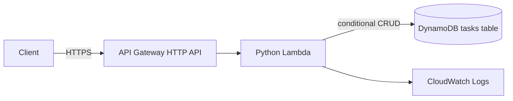

# Architecture

The API uses one Lambda function to keep this portfolio service inexpensive and easy to deploy. HTTP routing and validation live in `src/app.py`; DynamoDB access is isolated behind `TaskRepository`, enabling fast unit tests without AWS credentials. AWS SAM provides vendor-neutral CloudFormation deployment and local build validation.

## Reliability and security decisions

- DynamoDB uses on-demand billing, server-side encryption, and point-in-time recovery.
- The Lambda role is limited to CRUD operations on one table.
- Updates and deletes use conditional expressions so missing resources are not silently created.
- Client errors and server failures use different status codes; internal exceptions are logged without exposing details.
- Pagination cursors encapsulate DynamoDB continuation keys.
- CloudWatch log retention is explicit, avoiding indefinite log storage.

## Production extensions

For a multi-tenant production workload, add JWT authorization, tenant-scoped partition keys, AWS WAF, request throttling, tracing, alarms, and a DynamoDB GSI for status-based queries.
